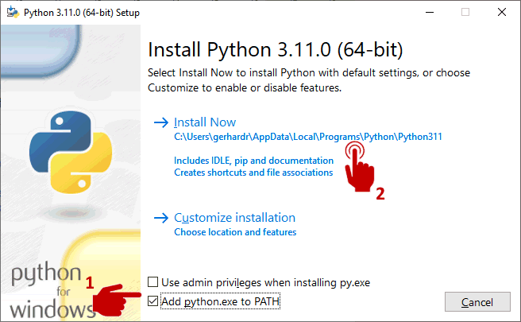

# Python installieren
Python ist eine leicht zu erlernende Skriptsprache, die wir sehr häufig in den praktischen Übungen zu unserem Buch verwenden. Wenn du auf deinem Laptop oder PC keine Software installieren darfst oder möchtest, weil dies zum Beispiel ein Firmen-Laptop oder ein ausgeliehener PC eines Bekannten ist, kannst du unsere [Übungen auch ohne installiertes Python nutzen](...).

Wenn du dir nicht sicher bist, ob ython schon installiert ist, kannst du in Windows im entpackten Verzeichnis unseres GitHub Repositories das Befehlsskript `01_python_version.cmd` per Doppelklick starten. Es zeigt dir entweder dieinstallierte Python-Version an, oder gibt aus, dass Python nicht als Befehl gefunden wurde. Wir empfehlen die Version 3.11 oder höher.

Die **unterstützten Betriebssysteme** findest du auf der [Python-Homepage](https://www.python.org/):
* Windows
* macOS
* Linux/UNIX
* andere Plattformen

**Zur Installation** sind nur wenige Schritte notwendig:
* Öffne die offizielle [Python Download](https://www.python.org/downloads)-Seite
* Lade von dort bitte die **64-bit** Version für das **Betriebssystem deines PCs oder Laptops** herunter.
* Starte den Installer und folge den Anweisung, oder lies genauer im [Beginners Guide](https://wiki.python.org/moin/BeginnersGuide/Download) für dein Betriebssystem.
  (1) Achte darauf, dass das Hinzufügen des Pfades angehakt ist.
  (2) Starte die Installation.

 
