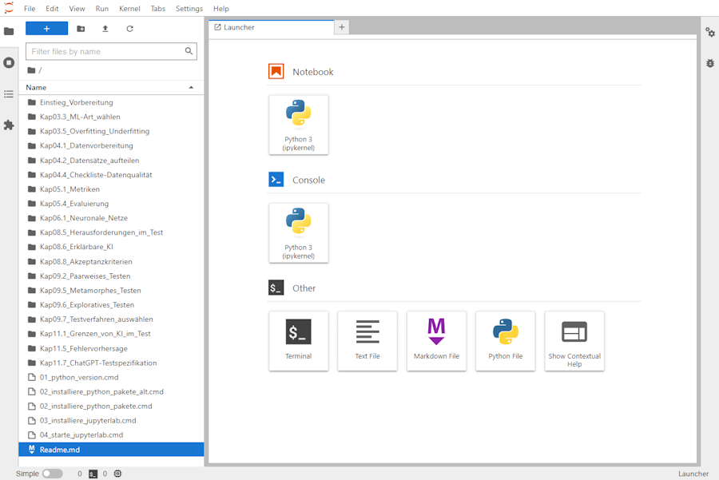

# Praktische Übungen zum Buch "KI-Testen"

Dieses Repository enthält das Begleitmaterial und praktische Übungen zum Buch "[**Basiswissen KI-Testen** - Qualität von und mit KI-basierten Systemen](https://dpunkt.de/produkt/basiswissen-ki-testen/)" aus dem **dpunkt.Verlag**, ISBN 978-3-86490-947-4.

Um die Übungen selbst auf *deinem eigenen Laptop oder PC* durchführen zu können, benötigst Du folgendes:
* Einen Laptop oder PC (ein Smartphone oder Tablet ist eher unpraktisch).
* Eine Installation von python auf deinem Computer (sie [Punkt 2 unten](#2.-Installation-von-python)).
* Grundkenntnisse in der [Programmiersprache python](https://tutorial.djangogirls.org/de/python_introduction)
* Grundkenntnisse in der [Benutzung von JupyterLab](https://jupyter-tutorial.readthedocs.io/de/latest/index.html)

## 1. Download des Übungsmaterials
* Lade von der GitHub Seite [KI-Testen - Übungen](https://github.com/KI-Testen/Uebungen) das gesamte Repository als ZIP-Datei (Code (grüner Button) > Download ZIP)
* Entpacke die ZIP in ein Verzeichnis deiner Wahl.

## 2. Installation von python, ML-Paketen und JupyterLab
* Als erstes musst du, wenn nicht schon vorhanden, [python installieren](Einstieg_Vorbereitung/Installation_Python.md).
* Ist python installiert, geht es mit der [Installation der python Pakete](Einstieg_Vorbereitung/Installation_Pakete.md) weiter
* Zum Schluß ist die [Installation von JupyterLab](Einstieg_Vorbereitung/Installation_JupyterLab.md) an der Reihe.

## 3. Los geht's: Starten von JupyterLab
Von nun ab kannst du JupyterLab per Coppel-Click auf: 
`04_starte_jupyterlab.cmd` starten. Als erstes öffnet sich ein Kommandozeilenfenster mit dem Titel "JupyterLab Server".

Nach dem Start des cmd-Skriptes startet zudem dein Browser und öffnet eine Seite, die sich mit dem JupyterLab Server (localhost:8888/lab/tree) verbindet, der im Kommandozeilenfenster läuft - lasse dieses also im Hintergrund weiter laufen!

Wenn du einen bestimmten Browser bevorzugst, kannst du die Datei `04_starte_jupyterlab.cmd` editieren und eine der drei per `::` auskommentierten Zeilen durch das Entfernen des `::` aktivieren und so deinen Lieblingsbrowser festlegen.

* *Diese* Anleitung (die du gerade liest) kannst du dir ansehen, wenn du mit der rechten Maustaste auf `Readme.md` clickst und *Open With > Markdown Preview* auswählst.

## 4. Mit den Aufgaben loslegen
*Hinweis:* Wir empfehlen dir, die Aufgaben nicht ohne eine gewisse Vorbereitung durch den entsprechenden Abschnitt im Buch zu beginnen.

*Außerdem:* Es ist gut, wenn du einfache Grundkenntnisse in python als Programmiersprache mitbringst, und dich mit der Bedienung von **JupyterLab** und Juypter **Notebooks** schon etwas vertraut gemacht hast ([siehe oben](#Praktische-%C3%9Cbungen-zum-Buch-%22KI-Testen%22)).

Zum Bearbeiten einer Aufgabe - zum Beispiel zum Abschnitt 3.3:
* öffnest du in JupyterLab per Doppel-Click das Verzeichnis `Kap03.3_ML-Art-wählen` und
* öffnest das Notebook `Übung_...` ebenfalls per Doppel-Click.

und schon kann's losgehen!

# Lizenzbedingungen

**der Inhalte *dieses* GitHub-Repos (Notebooks, Grafiken, Code...)**

&nbsp;&nbsp;&nbsp; 
CC BY-NC-SA 4.0 (https://creativecommons.org/licenses/by-nc-sa/4.0/)

**der genutzen Werkzeuge und Daten**

- pyhton: PSF License (https://docs.python.org/3/license.html - GPL-kompatibel)
- jupyterlab: BSD License (https://jupyterlab.readthedocs.io/en/latest/api/index.html?highlight=license#md:license)
- iris dataset: CC-BY 4.0, donated by R. A. Fisher (https://archive.ics.uci.edu/dataset/53/iris)
- tensorflow playground: [Apache License](https://github.com/tensorflow/playground/blob/master/LICENSE)
- lime: Copyright &copy; 2016, Marco Tulio Correia Ribeiro [BSD-2-Clause License](https://de.wikipedia.org/wiki/BSD-Lizenz)
- shap: Copyright &copy; 2018, Scott Lundberg [MIT License](https://en.wikipedia.org/wiki/MIT_License)
- pict: Copyright &copy; Microsoft Corporation [MIT License](https://en.wikipedia.org/wiki/MIT_License)
- chatGPT: OpenAI [Terms of Use](https://openai.com/policies/terms-of-use)
- OpenML(http://creativecommons.org/licenses/by/4.0/; https://opensource.org/licenses/BSD-3-Clause)
